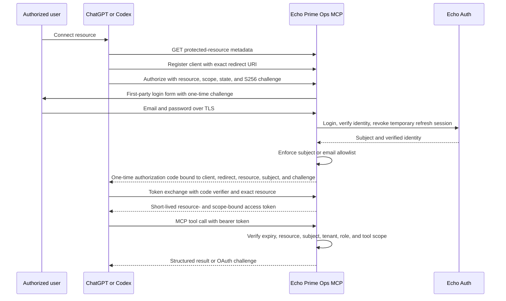

# Authentication and authorization

Echo Prime Ops is an OAuth 2.1 resource server with authorization-code flow and PKCE S256. Authentication
is performed by the existing Echo Auth service; the MCP server never implements a second password store.

## Discovery and resource binding

The public resource is `https://mcp.echo-op.com/oauth-mcp-echo-prime-ops-v1`. Its protected-resource
metadata is available at `/.well-known/oauth-protected-resource/oauth-mcp-echo-prime-ops-v1`; authorization
server metadata is at `/.well-known/oauth-authorization-server`. The token's resource must match exactly.
An Echo Prime Ops token is rejected at every other MCP path.

## Client and redirect validation

Dynamic client registration accepts only authorization-code clients using `token_endpoint_auth_method:none`
and nonempty HTTPS redirect URIs. Registration GET is rejected. Authorization requires an exact registered
client and redirect match, a valid state, an S256 challenge, an exact resource, and a subset of published
scopes. Authorization transactions are high entropy, expire in five minutes, are attempt-limited, and are
consumed once.

## Identity enforcement

Echo Auth performs login and verification. The temporary refresh session created for verification is revoked
immediately. The MCP server then requires a production `ECHO_OPS_ALLOWED_SUBJECTS` or
`ECHO_OPS_ALLOWED_EMAILS` allowlist; readiness fails closed if neither is configured. Subject allowlisting is
preferred because it is stable across email changes. Tenant and role are attached server-side, never accepted
from the model.

## Token checks and challenges

Every protected tool validates resource, expiry, not-before, subject, tenant, role, and minimum scope. Missing
or invalid credentials produce `WWW-Authenticate` and `_meta["mcp/www_authenticate"]` without an HTTP 500.
Wrong scope produces a typed forbidden result. Tokens, codes, verifiers, authorization headers, cookies,
passwords, and login challenges are redacted from logs.

## Revocation and recovery

Authorization codes are one-use. Access tokens expire; token state is bounded and saved atomically. Echo Auth
revocation is used for the temporary verification session. If identity verification, allowlist evaluation, or
state persistence fails, authorization fails closed and no access token is issued.
